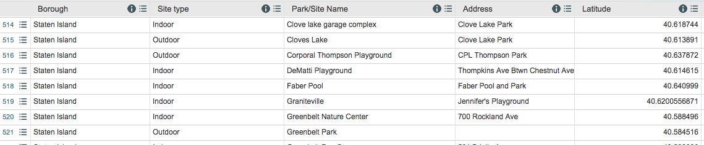

# recycle
The Best "ReWorked" App Ever
***
Recyc.ly is an app to help you find a place to recycle your garbage in the NYC area. Using the CLI,
simply enter your borough and destination information. For example, if I am headed to Hudson River Park, I would enter 'Manhattan', then 'park', and select the name of the park from the list of parks. The results will then display the number of recycling bins and list the top ten addresses of the closest recycling bins in the area.
***

We filtered the data using Open URI and JSON to get this (eek!):

***
We then filtered the data through ruby, to then present a simple command-line interface that narrows down locations of recycling bins. This make the data more user-friendly, and encourages recycling!
***

